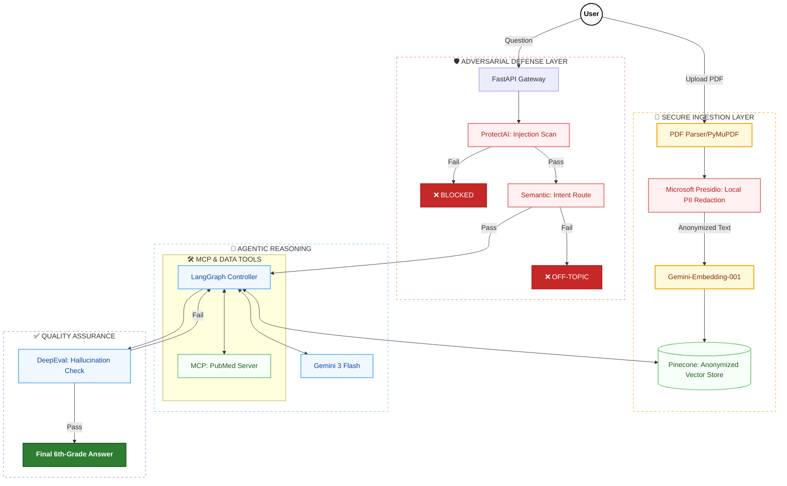

# CliniClarity: From Medical Anxiety to Medical Literacy

**A personal health research assistant designed to be a bridge between a clinical visit and a patient's home life.**

## 📋 Product Vision and Strategy 
CliniClarity is not a diagnostic engine; it is a specialized AI Security Architect-led research platform engineered to help patients navigate complex medical journeys with grounded, verifiable intelligence.

### The Problem: Dense Jargon and "Dr.Google
* **Medical Complexity:** Patients receive dense reports where critical insights are buried in peer-to-peer clinical shorthand.
* **The Hallucination Risk:** General LLMs often "guess" or prioritize SEO-optimized blogs over clinical reality.
* **Security Vulnerabilities:** Standard AI wrappers are susceptible to prompt injections and PII leaks, making them unsuitable for healthcare.

### The Solution: Deterministic & Grounded Intelligence
CliniClarity provides an evidence-based pipeline where every response is mathematically and clinically verified.
* **Security-First:** Implements local adversarial defense to block prompt injections before they reach the reasoning engine.
* **Clinically Grounded:** Uses a dedicated FastMCP server to query high-authority databases like PubMed.
* **Verified Output:** Utilizes DeepEval to audit for hallucinations, ensuring the final answer strictly adheres to the provided medical context.

## 🛠️ Agent Architecture

#### Visualizing the Pipeline

#### 🚀 Key Technological Pillars
Below is the architectural blueprint of CliniClarity, illustrating the flow from secure ingestion to verified synthesis.
1. **The Agentic Core: LangGraph & Native Tool Calling**
   We moved beyond linear chains to a State Machine architecture using LangGraph.
     *  **Deterministic Flow:** Each stage—from ingestion to synthesis—is a verifiable node in the graph.
     *  **Native Tool Calling:** Deprecated legacy ReAct text-parsing in favor of Native JSON Tool Calling, reducing hijacking risks and improving response latency.
3. **Multi-Layered Guardrails (Adversarial Defense)**
   To ensure HIPAA-grade safety, the system implements a "Defense-in-Depth" strategy:
     * **Prompt Injection Defense:** Integrated a local Hugging Face SLM (ProtectAI DeBERTa) to block adversarial attacks before they reach the LLM.
     * **Semantic Routing:** Uses cosine similarity math to ensure the system strictly only processes clinical and biological queries.
4. **FastMCP: Medical Knowledge Integration**
   Utilizing the **Model Context Protocol (MCP)**, CliniClarity securely bridges the gap between patient data and external clinical literature.
     * **PubMed Server:** A standalone MCP server queries the National Library of Medicine directly, providing the agent with peer-reviewed verification of medical terms found in the user's report.

* **Tech Stack**: Built using AWS Bedrock, OpenSearch Serverless, and Claude Sonnet/Nova Pro
#### Security & HIPAA-First Data Pipeline
To ensure sensitive data is never used to train public models, CliniClarity implements an automated redaction pipeline.
* **PII/PHI Redaction:** A dedicated Lambda function matches PHI found by AWS Comprehend Medical to coordinates provided by AWS Textract
* **Sanitization:** Uses the ReportLab library to draw solid black boxes over sensitive metadata, ensuring it cannot be searched or highlighted.

## 🚀 Key Benefits
| Feature | Traditional LLMs / Search Engines | CliniClarity (Our Product) | PLM Strategic Value |
|--------|----------------------------------|---------------------------|---------------------|
| **Information Source** | Guesses based on patterns or SEO-optimized blogs | Grounded in patient records and vetted medical journals | **Trust:** Reduces medical anxiety by ensuring 100% clinical validity |
| **Logic & Reasoning** | Single-shot responses often prone to hallucinations | ReAct Loop: Thinking → Action → Observation before answering | **Accuracy:** Forces the model to reason through clinical steps before delivery |
| **Data Privacy** | Sensitive data may be used to train public models | Healthcare-grade security with automated PII/PHI redaction | **Compliance:** Built with Privacy by Design to meet HIPAA-grade standards |
| **Traceability** | Provides general advice without specific source links | Every statement is directly linked to a record line or a DOI | **Auditability:** Empowers patients with exact evidence for doctor consultations |
| **Knowledge Retrieval** | Limited to the model's training cutoff date | Tiered Retrieval: Vector Store (Internal) + PubMed (External) | **Efficiency:** Prioritizes user context first, augmenting with external data only when needed |

## 👥 The Team
This product was developed by a cross-functional team with expertise across the full software lifecycle:
* **Bruno:** Containerization and Infrastructure
* **Niall:** User research and HIPAA Compliance
* **Greti:** Machine Learning, Testing and QA
* **Ramsundhar:** Cloud Architecture and Agentic AI

## Technical Appendix
#### Orchestration: LangChain & Agentic Logic
To manage the complex ReAct (Reasoning and Acting) loop, we utilize LangChain as the core orchestration framework. This allows us to move beyond simple chat interfaces into autonomous problem-solving.
* **State Management:** LangChain manages the conversational memory and the "state" of the research assistant, ensuring that follow-up questions maintain the context of the initial medical report.
* **Tool Binding:** We use LangChain to bind the Tavily Search API and PubMed as executable tools that the LLM can "decide" to call when internal context from the vector store is insufficient.
* **Prompt Engineering:** LangChain templates are used to enforce the Thinking -> Action -> Observation cycle, preventing the model from providing unverified medical advice by strictly defining its persona as a "Research Librarian".
#### Infrastructure as Code (IaC): Terraform
To ensure the product can be deployed reliably across different environments (Dev, QA, Production), the entire AWS architecture is managed via Terraform.
* **Reproducibility:** Every component—from S3 buckets and Lambda functions to OpenSearch Serverless collections—is defined in declarative .tf files.
* **Security Configuration:** Terraform is used to manage strict IAM roles and policies, ensuring the "Principle of Least Privilege" is applied to the data redaction pipeline.
* **Scalability:** By using Terraform modules, we can quickly scale the Bedrock Knowledge Bases and vector indices as the volume of processed medical documents grows.
#### Core AWS Services
* **AWS Bedrock:** Provides access to high-performance models like Claude Sonnet and Nova Pro via a serverless API, reducing the overhead of managing specialized AI hardware.
* **OpenSearch Serverless:** Serves as our vector database, storing embeddings of patient reports for sub-second retrieval during the RAG phase.
* **Lambda & S3 Event Notifications:** Automates the lifecycle of a document; the moment a PDF hits the `/INPUT` bucket, a Lambda triggers the redaction and subsequent ingestion jobs.
* **Comprehend Medical:** An NLP service specifically tuned to detect Protected Health Information (PHI) within clinical text, forming the backbone of our HIPAA compliance strategy.

