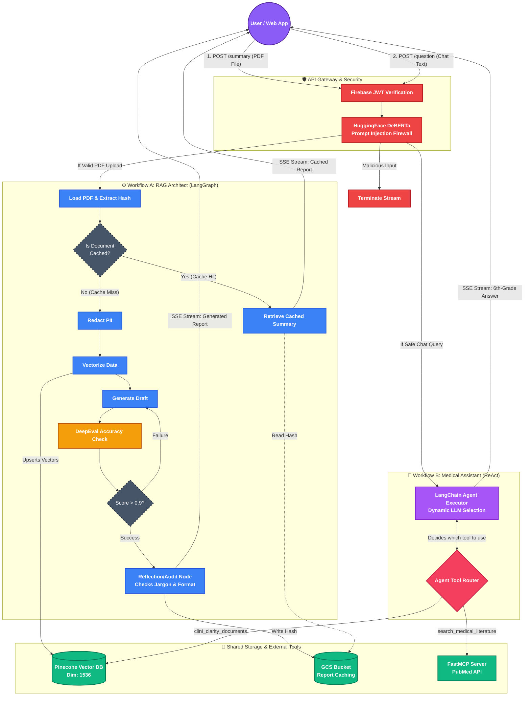
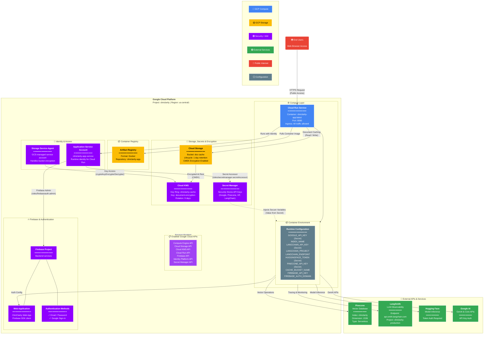

# CliniClarity: From Medical Anxiety to Medical Literacy

**A personal health research assistant designed to be a bridge between a clinical visit and a patient's home life.**

## 📋 Product Vision and Strategy 
For patients and families who feel lost in medical jargon or overwhelmed by scary, unverified internet searches , CliniClarity is a personal health research assistant that turns dense medical reports into clear, easy-to-understand summaries. Unlike general search engines that prioritize marketing and ads, our tool ensures every answer is directly backed by your specific health records and peer-reviewed medical journals. 

### How It Works
CliniClarity bridges the gap between complex clinical documentation and patient comprehension through a secure, multi-agent architecture:

* **Patient-Centric Summarization:** Transforms dense clinical notes, lab results, and discharge summaries into plain language without losing critical medical context.
* **Evidence-Based Grounding:** Utilizes Retrieval-Augmented Generation (RAG) to ensure explanations are tied strictly to verified medical literature and the user's uploaded documents, eliminating the noise of standard web searches.
* **Strict Clinical Auditing:** Employs DeepEval for rigorous hallucination checks, ensuring the AI agent remains factually accurate and strictly adheres to the provided medical context.
* **Privacy First (HIPAA Aligned):** Built with security at the forefront. Documents undergo automated PII (Personally Identifiable Information) redaction before processing, ensuring patient data remains anonymous and secure within our Google Cloud Run and Firebase ecosystem.

### Under the Hood

To deliver a reliable and secure experience, CliniClarity is powered by a modern, cloud-native AI stack:
* **Core Logic:** Python, LangChain, and LangGraph for orchestrating autonomous medical agents.
* **Infrastructure:** Serverless deployment on Google Cloud Platform via Terraform.
* **Security & Auth:** Firebase Authentication, local HuggingFace prompt-injection firewalls, and Google Cloud Secret Manager.
* **Quality Assurance:** DeepEval for continuous metric-driven testing of AI outputs.

---

## 🛠️ Agent Architecture

#### Visualizing the Pipeline

---

#### 🚀 Key Technological Pillars
Below is the architectural blueprint of CliniClarity, illustrating the flow from secure ingestion to verified synthesis.
1. **The Agentic Core: LangGraph & Native Tool Calling**
   We moved beyond linear chains to a State Machine architecture using LangGraph.
     *  **Deterministic Flow:** Each stage—from ingestion to synthesis—is a verifiable node in the graph.
     *  **Native Tool Calling:** Deprecated legacy ReAct text-parsing in favor of Native JSON Tool Calling, reducing hijacking risks and improving response latency.
2. **Multi-Layered Guardrails (Adversarial Defense)**
   To ensure HIPAA-grade safety, the system implements a "Defense-in-Depth" strategy:
     * **Prompt Injection Defense:** Integrated a local Hugging Face SLM (ProtectAI DeBERTa) to block adversarial attacks before they reach the LLM.
     * **Semantic Routing:** Uses cosine similarity math to ensure the system strictly only processes clinical and biological queries.
3. **FastMCP: Medical Knowledge Integration**
   Utilizing the **Model Context Protocol (MCP)**, CliniClarity securely bridges the gap between patient data and external clinical literature.
     * **PubMed Server:** A standalone MCP server queries the National Library of Medicine directly, providing the agent with peer-reviewed verification of medical terms found in the user's report.
4. **Verification & QA: DeepEval**
   Every response undergoes an automated hallucination check. Using **DeepEval**, the system measures "Faithfulness" by comparing the generated answer against the retrieved document chunks, preventing the model from inventing clinical findings.

---

#### 🛠️ The Tech Stack
1. **Core AI & Orchestration (Agentic RAG)**
   * **Orchestration:** LangGraph (State Machine logic) & LangChain (Tool binding)
   * **Reasoning Engine**: Gemini 3 Flash (Native Tool Calling)
   * **Knowledge Retrieval:** Tiered RAG (Internal Pinecone Vector Store + External PubMed MCP)
   * **Verification:** DeepEval (Deterministic Hallucination & Faithfulness auditing)
2. **Security & Guardrails**
   * **Adversarial Defense:** ProtectAI DeBERTa (Local Prompt Injection detection)
   * **Data Privacy:** **Microsoft Presidio** (Local PII/PHI redaction)
   * **Intent Routing:** Semantic Vector Router (Cosine Similarity topic enforcement)
3. **Data & Infrastructure**
   * **Vector Database:** Pinecone (Serverless)
   * **Infrastructure as Code:** Terraform (GCP infrastructure)
   * **API Layer:** FastAPI with Asynchronous Server-Sent Events (SSE)

---

#### 🔒 Security & HIPAA-First Data Pipeline
To ensure Protected Health Information (PHI) is never exposed to public models or unauthorized cloud logs, CliniClarity implements a "Local-First" automated redaction pipeline. This architecture satisfies HIPAA "Safe Harbor" standards by de-identifying data before it enters the RAG ecosystem.

* **Deterministic PII/PHI Redaction:** Instead of relying on cloud-based NLP, CliniClarity utilizes a local instance of Microsoft Presidio. This engine performs Named Entity Recognition (NER) to identify 18+ types of identifiers (Names, SSNs, Phone Numbers, Locations) directly within the secure application boundary.

* **Zero-Egress Sanitization:** The redaction process uses the Presidio-Anonymizer to replace sensitive metadata with generic placeholders (e.g., [REDACTED_NAME]) or cryptographic hashes. This ensures that the text remains clinically useful for the LLM while being mathematically stripped of identity.

* **Safe Harbor Compliance:** By scrubbing data locally before it reaches the Gemini Embedding or Pinecone Vector Store, the system ensures that no PII is ever used for model training or stored in a third-party database.

* **Immutable Redaction (PDF):** For document visualization, the system utilizes the ReportLab library to draw physical, non-recoverable black boxes over identified PHI coordinates, ensuring sensitive data cannot be recovered via text highlighting or metadata scraping.

---

#### 🚀 Key Strategic Benefits
| Feature | Traditional LLMs / Search Engines | CliniClarity (Our Product) | PLM Strategic Value |
|--------|------------------------------------|----------------------------|---------------------|
| **Information Source** | Guesses based on patterns or SEO-optimized blogs | Grounded in patient records and peer-reviewed PubMed literature | **Trust:** Reduces medical anxiety by ensuring 100% clinical validity. |
| **Logic & Reasoning** | Single-shot responses prone to hallucinations | Agentic RAG: Multi-turn reasoning with native tool calling | **Accuracy:** Eliminates "guessing" by forcing the model to verify facts against clinical data. |
| **Data Privacy** | Sensitive data may be used to train public models | Local PII/PHI redaction via Microsoft Presidio before cloud egress | **Compliance:** Built with "Privacy by Design" to meet HIPAA Safe Harbor standards. |
| **Adversarial Security** | Vulnerable to prompt injections and jailbreaks | Deterministic Guardrails: Local ProtectAI scan and Semantic Routing | **Safety:** Prevents system hijacking and ensures the agent remains strictly within the medical domain. |
| **Auditability** | Provides general advice without specific source links | Every response is cited with a specific DOI and evaluated via DeepEval | **Reliability:** Empowers patients with verifiable evidence for physician consultations. |
| **Knowledge Retrieval** | Limited to the model's training cutoff date | Real-time Tiered Retrieval: Vector Store (Internal) + FastMCP (External) | **Efficiency:** Prioritizes specific patient context while augmenting with the latest medical research. |

---

## Cloud Architecture
The application is deployed as a fully managed, serverless architecture on Google Cloud Platform (GCP). It utilizes Cloud Run for scalable compute, Firebase for secure identity management, and KMS-encrypted Cloud Storage to safely handle semantic caching.

---

## 🔒 Security & HIPAA-First Standards
To ensure Protected Health Information (PHI) is never exposed to public models or unauthorized cloud logs, CliniClarity implements a "Local-First" automated redaction pipeline. This architecture satisfies HIPAA "Safe Harbor" standards by de-identifying data before it enters the RAG ecosystem.

* **Deterministic PII/PHI Redaction:** Instead of relying on cloud-based NLP, CliniClarity utilizes a local instance of Microsoft Presidio. This engine performs Named Entity Recognition (NER) to identify 18+ types of identifiers (Names, SSNs, Phone Numbers, Locations) directly within the secure application boundary.

* **Zero-Egress Sanitization:** The redaction process uses the Presidio-Anonymizer to replace sensitive metadata with generic placeholders (e.g., [REDACTED_NAME]) or cryptographic hashes. This ensures that the text remains clinically useful for the LLM while being mathematically stripped of identity.

* **Safe Harbor Compliance:** By scrubbing data locally before it reaches the Gemini Embedding or Pinecone Vector Store, the system ensures that no PII is ever used for model training or stored in a third-party database.

* **Immutable Redaction (PDF):** For document visualization, the system utilizes the ReportLab library to draw physical, non-recoverable black boxes over identified PHI coordinates, ensuring sensitive data cannot be recovered via text highlighting or metadata scraping.
  
* **Customer-Managed Encryption Keys (CMEK):** All temporary data and semantic caching stored in Google Cloud Storage is encrypted at rest using Google Cloud KMS, with rigorous 9-day key rotation schedules and strict 1-day lifecycle deletion rules.
  
* **Adversarial Defense:** Every user query is scanned by ProtectAI to detect prompt injections, ensuring the agent cannot be manipulated into revealing system prompts or bypassing clinical guardrails.
  
* **Least Privilege Identity:** Cloud Run services execute under a dedicated Google IAM Service Account (cliniclarity-app-service), granting access only to the specific resources and Firebase administration privileges required for runtime operations.

---

## 📚 Official Documentation

For a deeper dive into the engineering decisions, compliance standards, and future plans for CliniClarity, please refer to our official documentation library:

* **[Product Requirements Document (PRD)](PRD.md):** The complete architectural blueprint, user personas, and success metrics.
* **[Security & Compliance Architecture](Compliance.md):** Details on our zero-trust ingress, irreversible local redaction, and HIPAA-aligned vector isolation.
* **[V1.0 Execution Roadmap](Roadmap.md):** Our project timeline, milestones, and transition to a cloud-native agentic architecture.
  
* **Architecture Decision Records (ADRs):**
  * **[Hallucination Auditing with DeepEval](architecture/decisions/DeepEval-Auditing.md)**
  * **[Standardizing on Google Cloud Platform](architecture/decisions/GCP.md)**
  * **[Gemini Model Selection](architecture/decisions/Gemini-Model-Choice.md)**
  * **[Infrastructure as Code (IaC) via Terraform](architecture/decisions/IAC-Decision.md)**
  * **[Local PII/PHI Redaction with Presidio](architecture/decisions/Presidio-Redaction.md)**
  * **[Orchestration Framework Selection](architecture/decisions/Orchestration-Framework.md)**
  * **[Adversarial Prompt Defense with Protect AI](architecture/decisions/Protect-AI.md)**

---

## 🚀 Getting Started & Deployment

To deploy your own instance of CliniClarity to Google Cloud Platform using our automated Terraform infrastructure, please refer to our dedicated deployment manual:

👉 **[View the Step-by-Step Deployment Guide](Deployment.md)**
*(Note: Ensure you have Docker, Terraform, and the Google Cloud CLI installed before beginning).*

---
  
## 👥 The Team
This product was developed by a cross-functional team with expertise across the full software lifecycle:
* **Greti:** Compliance Documentation
* **Ramsundhar:** Cloud Architecture and Agentic AI

---

## Technical Appendix

### Orchestration: LangChain & Agentic Logic
To manage the complex clinical reasoning required for healthcare, CliniClarity utilizes **LangGraph** as its core orchestration framework. This allows the system to move beyond linear chains into a robust, cyclic state machine.
* **State Management:** Every interaction is managed as a discrete state within the graph. This ensures that the context from the initial PDF ingestion remains persistent and immutable throughout the follow-up research phase.
* **Self-Correction Loop:** The graph includes conditional edges that route responses through a DeepEval node. If the "Faithfulness" score falls below a specific threshold, the state is routed back to the reasoning engine for refinement, preventing hallucinations before they reach the UI.
* **Native Tool Calling:** Unlike traditional ReAct loops that parse raw text, we utilize Native JSON Tool Calling. This forces the model to interact with external systems (like PubMed) using strictly typed schemas, significantly reducing the risk of tool-hijacking and parsing errors.

---

### Infrastructure as Code (IaC): Terraform
To ensure the product can be deployed reliably across different environments (Dev, QA, Production), the entire Google Cloud architecture is defined and deployed via **Terraform**.
* **Serverless Compute Provisioning:** Terraform handles the automated deployment of Google Cloud Run v2 services, pointing directly to versioned container images stored in Google Artifact Registry.
* **Integrated Identity & Auth:** Firebase Projects, Web Apps, and Identity Platform configurations (supporting Email/Password and Google Sign-In) are fully automated and bound to the application's environment variables natively within the Terraform state.
* **Secure Storage Infrastructure:** GCS buckets utilized for semantic caching are provisioned with 1-day TTL lifecycle rules and strictly enforced Uniform Bucket-Level Access.
* **Automated Encryption Bindings:** Terraform dynamically provisions Cloud KMS KeyRings and CryptoKeys, automatically attaching the required `cryptoKeyEncrypterDecrypter` IAM roles to the underlying storage service agents to ensure seamless CMEK encryption without manual intervention.

---
  
## Core System Components
* **Gemini 3 Flash:** Serves as the high-speed reasoning engine, selected for its massive context window and native support for asynchronous tool calling.

* **FastMCP (Model Context Protocol):** Orchestrates the connection between the LLM and the National Library of Medicine. By running PubMed as a standalone MCP server, we decouple the knowledge retrieval logic from the core application.

* **Microsoft Presidio:** A localized PII/PHI redaction engine that identifies and scrubs 18+ types of sensitive identifiers at the point of ingestion, ensuring HIPAA "Safe Harbor" compliance without sending raw data to the cloud.

* **Pinecone:** A high-performance vector database that stores the anonymized embeddings of clinical reports, enabling sub-second Retrieval-Augmented Generation (RAG).

* **DeepEval:** A specialized testing framework used to objectively audit the agent's output. It acts as the final "clinical auditor," measuring the factual alignment between the generated summary and the source medical records.

* **Google Cloud Run:** A fully managed serverless compute platform that auto-scales the containerized LangGraph application natively, abstracting away server administration while ensuring rapid scale-up for concurrent users.
  
* **Firebase Identity Platform:** Secures user access with enterprise-grade authentication via Google Sign-In and standard credentials, deeply integrated with the application's service accounts.

