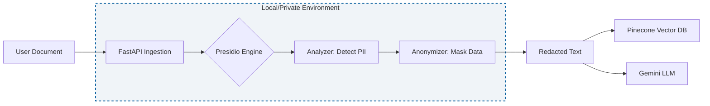

# Architecture Decision Record: Local PII Redaction with Microsoft Presidio

* **Status:** Accepted
* **Date:** 2026-02-09

## Context
The CliniClarity agent processes sensitive medical reports (PDFs) that contain Personally Identifiable Information (PII) such as patient names, dates of birth, and medical record numbers. To ensure privacy and security, this data must be redacted before it is sent to external LLMs (Gemini) or stored in cloud vector databases (Pinecone).

## Decision: Use Microsoft Presidio for Local Redaction
We will implement **Microsoft Presidio** as a Python-based library running directly on the local machine (or within our private AWS EC2 instances) to handle all anonymization tasks.
### Architecture Diagram

## Detailed Rationale:
* **Lightweight Implementation:** Presidio is a Python library that integrates directly into our existing Ingestion.py workflow without requiring heavy infrastructure overhead.
* **No Third-Party Data Control:** By running the engine locally, sensitive medical data is never sent to a third-party redaction API (e.g., AWS Comprehend PII), ensuring we maintain a "Zero Trust" posture.
* **Full Usage Control:** We have absolute authority over which "Recognizers" are active and how data is masked (e.g., replacing a name with [PATIENT] vs. completely removing it).
* **Latency Optimization:** Eliminating network round-trips to external security APIs ensures the agent maintains the high-performance streaming required for real-time summaries.
* **Cost-Effectiveness:** There are no per-request costs associated with local execution, which is critical for scaling an entry-level project into an enterprise-ready system.
* **Custom Medical Recognizers:** We can extend Presidio with custom logic to detect specific clinical jargon or hospital-specific IDs that general-purpose tools might miss.
* **Auditability and Logging:** Redaction events can be logged to our local activity.log for debugging without risk of leaking PII to cloud-based logging services.
* **PHI De-identification:** Ensures Protected Health Information (Names, DOBs) is stripped locally so it never enters the cloud-based LLM, satisfying the HIPAA Privacy Rule.

## Consequences
* **Advantages**:
    * Maximum data privacy for healthcare compliance.
    * Reduced cloud service dependencies.
    * Enhanced "Security Architect" profile for the project portfolio.
* **Disadvantages:**
    * Local CPU/RAM usage increases during document ingestion.
    * Requires manual updates to Presidio's detection models to stay current with new PII patterns.

## Alternative Considerations
* **AWS Comprehend PII:** Rejected due to external data transit and per-token costs.
* **Manual Regex Redaction:** Rejected as it is too brittle for complex medical reports and fails to catch context-based PII.
