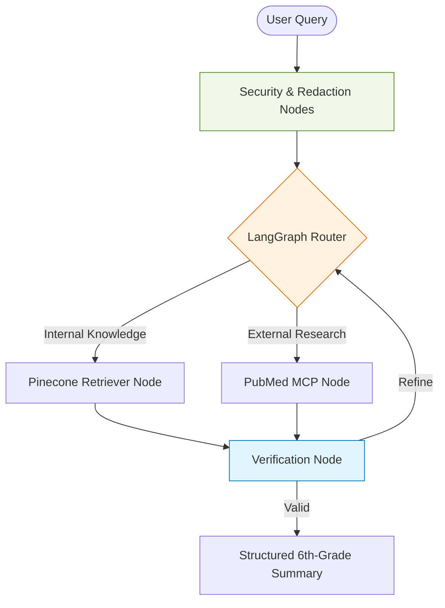

# Architecture Decision Record: Orchestration with LangChain and LangGraph

**Status:** Accepted  
**Last Updated:** 2026-02-02   

##  Context
The CliniClarity application requires a sophisticated orchestration layer to manage interactions between LLMs (Gemini), vector databases (Pinecone), and external medical APIs (PubMed via MCP). A standard "black box" agent is insufficient for a medical context where reasoning steps must be transparent, secure, and highly controlled.

## Decision: Adopt LangChain and LangGraph
We have selected LangChain for its extensive tool ecosystem and LangGraph for its ability to model the agent as a stateful, cyclic graph. 

### Framework Flow Diagram

## Decision
* **State Machine Logic:** LangGraph allows for the explicit definition of nodes and edges, ensuring the agent follows a deterministic logical path rather than unpredictable autonomous loops.
* **Customizable Nodes:** Every step—from data retrieval to clinical reasoning—is a distinct Python function that can be independently debugged and optimized.
* **Security Injection:** The framework facilitates the insertion of pre-processing nodes, such as the is_prompt_injection check and Presidio redaction, before the LLM is ever engaged.
* **Human-in-the-loop (HITL):** LangGraph supports "breakpoints," allowing a medical professional to verify an agent's reasoning before the final output is delivered.
* **Output Consistency:** Using ChatPromptTemplate and the init_chat_model allows for strict enforcement of the 6th-grade reading level constraint.
* **Event-Driven Streaming:** The use of astream_events provides a "neat" user experience by streaming tokens in real-time while allowing the backend to track which specific node (LLM vs. Tool) is active.
* **Detailed Tracing:** Native integration with X-Ray and LangSmith ensures that every decision made by the graph is logged for auditability—a critical requirement for healthcare architecture.
* **Model Agnostic:** Through init_chat_model, we can dynamically swap the underlying LLM (e.g., from Gemini to a HIPAA-compliant private model) without rewriting the core logic.
* **Scalable Tools:** New tools, such as additional MCP servers for different medical databases, can be added as nodes with minimal changes to the existing graph.

## Consequences
* **Advantages:**
  * Provides the "Enterprise" level of control required for clinical systems.
  * Ensures safety protocols are enforced at the code level, not just via prompting.
  * Simplifies the implementation of complex RAG patterns.
* **Disadvantages:**
  * Higher initial learning curve compared to simple "Chat" wrappers.
  * Requires careful management of the "State" object to prevent memory bloat in long conversations.
## Alternatives Considered
* CrewAI relies on autonomous, heuristic reasoning that is simply too unpredictable for a high-stakes clinical environment where unskippable, sequential steps like Presidio redaction and prompt injection checks must be guaranteed every single time.
* No-code platforms fail our core architectural requirement of local control because they force the upload of sensitive, unredacted patient PDFs to a third-party cloud environment before any security processing can occur, creating an unacceptable privacy risk.

