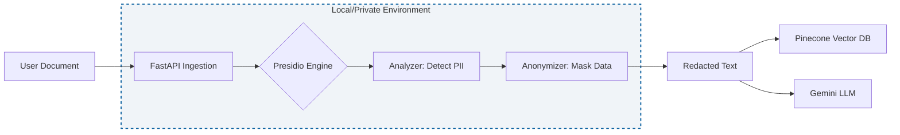

# Architecture Decision Record: Local PII Redaction with Microsoft Presidio

* **Status:** Accepted
* **Date:** 2026-02-09

## Context
The CliniClarity agent processes sensitive medical reports (PDFs) that contain Personally Identifiable Information (PII) such as patient names, dates of birth, and medical record numbers. To ensure privacy and security, this data must be redacted before it is sent to external LLMs (Gemini) or stored in cloud vector databases (Pinecone).

## Decision: Use Microsoft Presidio for Local Redaction
We will implement **Microsoft Presidio** as a Python-based library running directly on the local machine (or within our private AWS EC2 instances) to handle all anonymization tasks.
### Architecture Diagram

* **Detailed Rationale:**
    1.  **Library Maturity (The Primary Driver):**
        The core requirement is "coordinate-based redaction" (drawing shapes at specific X,Y locations).
        * **Python:** The `PyMuPDF` library provides a robust `page.add_redact_annot()` method that physically removes underlying text and rasterizes the redaction area. This is critical for HIPAA compliance to prevent "copy-paste" leaks under black boxes.
        * **Go:** While Go has PDF libraries (e.g., `unidoc`), they are often commercial/licensed or lack mature "destructive redaction" capabilities comparable to PyMuPDF's open-source feature set.

    2.  **AWS Integration:**
        The `boto3` library in Python provides first-class support for the complex JSON structures returned by `Textract` and `ComprehendMedical`. Parsing nested JSON blocks for "BoundingBox" geometries is significantly more verbose in Go (requires struct mapping) compared to Python's dynamic dict handling.

    3.  **Prototyping Velocity:**
        Python allowed for rapid iteration of the "OCR-to-Redaction" loop. Given the strict deadline for the MVP, the development speed of Python outweighed the execution speed of Go.

* **Consequences:**
    * **Positive:**
        * **Code Simplicity:** The entire redaction logic fits in approximately 50 lines of code, making it highly maintainable.
        * **Maintenance:** Future engineers (or data scientists) can easily modify the logic as Python is the standard language for AI/ML pipelines.
    * **Negative:**
        * **Cold Start Latency:** Python runtimes on AWS Lambda have slower cold starts than Go.
        * **Deployment Size:** The `PyMuPDF` library requires binary dependencies (`manylinux` wheels), increasing the Lambda package size.
    * **Mitigation Strategy:**
        * We implemented **AWS Lambda Layers** in Terraform (`main.tf`) to isolate the heavy `PyMuPDF` dependency from the application logic. This keeps the function deployment lightweight and allows for caching the layer.
        * We pinned the Python version to `3.8` and utilized `manylinux2014_x86_64` wheels to ensure binary compatibility with the AWS Lambda environment.
